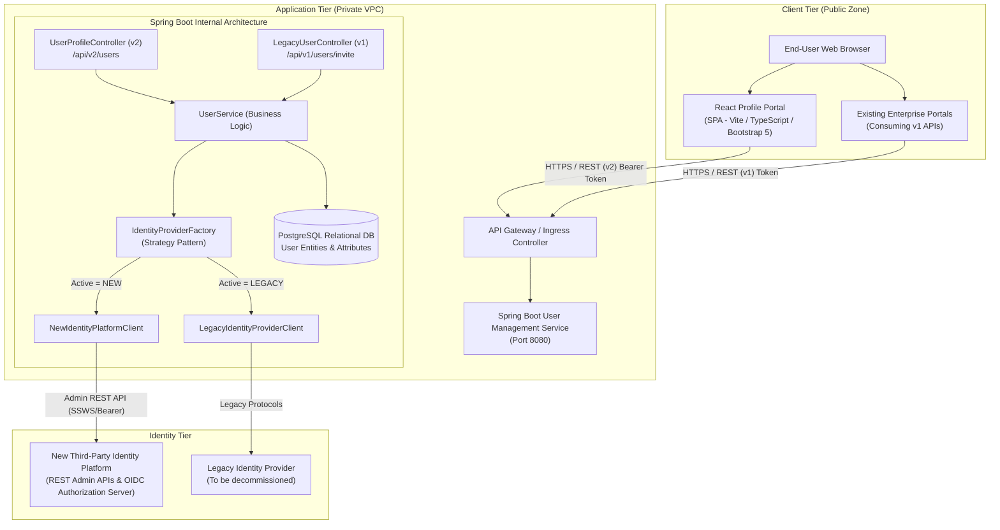
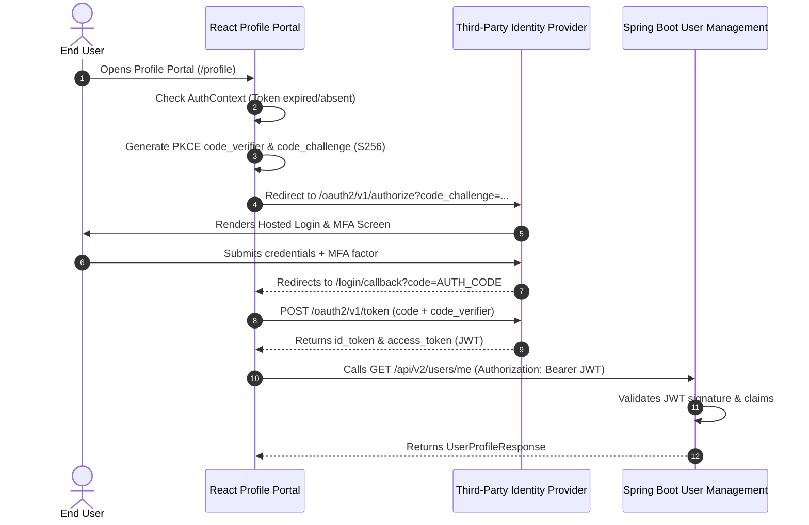

# Enterprise Architecture: Identity Provider Migration

## 1. Executive Summary & Goals
This architecture modernizes the enterprise identity stack by decoupling identity lifecycle management from custom backend credential storage. The organization is migrating from a legacy in-house/on-premise Identity Provider to a modern third-party Identity Platform (such as Okta, Ping Identity, Auth0, or Keycloak).

### Primary Principles:
1. **Zero Secret Exposure in Frontend**: The React frontend is a public client. It never stores client secrets or directly queries downstream administrative identity APIs.
2. **Identity Provider Boundaries**:
   - **Identity Provider Responsibility**: User authentication, password policies, MFA challenge & enrollment (SMS, TOTP, FIDO2), SSO session management, token issuance (JWT/OIDC).
   - **React Profile Portal Responsibility**: Custom enterprise user profile collection, validation (rich Date-of-Birth checking, address normalization, department assignment), and calling the backend integration layer.
   - **Spring Boot Responsibility**: Integration facade, confidential OIDC client, legacy backward compatibility, and business-tier orchestrations.

---

## 2. Component Topology

---

## 3. OIDC & Authentication Code Flow with PKCE

For authentication, users authenticate directly via the Identity Provider:

---

## 4. Key Design Patterns

### A. Adapter / Strategy Pattern
The `IdentityProviderClient` interface standardizes methods for provisioning, retrieving, and updating user records across different identity providers:
- `NewIdentityPlatformClient`: Targets new REST endpoints (`/v1/users`).
- `LegacyIdentityProviderClient`: Maintains the older invitation/token approach.
- `IdentityProviderFactory`: Selects which adapter to invoke based on environment configuration or tenant metadata.

### B. Two-Phase Provisioning Flow
Instead of legacy invitation emails where tokens are validated on a custom screen:
1. **Creation**: React portal calls `POST /api/v2/users`. The user is staged in the third-party identity platform with status `PENDING_ACTIVATION`.
2. **First-Login Activation**: The user is guided to the Identity Provider's native activation flow, setting their password and registering required MFA factors (TOTP/SMS/Security Keys).
---

## 5. PKCE Cryptographic Implementation (RFC 7636)
To prevent authorization code interception without requiring a client secret on the public client:
1. **High-Entropy Verifier**: The browser generates a cryptographically random 64-character string using `window.crypto.getRandomValues`.
2. **SHA-256 Code Challenge**: The string is hashed with SHA-256 via `window.crypto.subtle.digest('SHA-256', ...)` and encoded as URL-safe base64 (`code_challenge_method=S256`).
3. **Validation**: The Identity Provider verifies the received verifier against the previously sent challenge before issuing tokens.
Implemented in [profile-portal/src/services/pkce.ts](file:///Users/bhanu/Documents/ep/profile-portal/src/services/pkce.ts).

---

## 6. Enterprise Deployment & CI/CD Architecture
- **CI/CD Pipeline**: Automated GitHub Actions workflow in [`.github/workflows/ci-cd.yml`](file:///Users/bhanu/Documents/ep/.github/workflows/ci-cd.yml) enforcing Java & React tests, Trivy container vulnerability scanning, and multi-stage rollouts.
- **Kubernetes Manifests**: Full declarative manifests in [`k8s/`](file:///Users/bhanu/Documents/ep/k8s) including Ingress with TLS termination, backend and frontend deployments with HPA, non-root security contexts, and zero-trust `NetworkPolicy`.
- See [docs/DEPLOYMENT_AND_CICD_GUIDE.md](file:///Users/bhanu/Documents/ep/docs/DEPLOYMENT_AND_CICD_GUIDE.md) for full operational runbooks.

