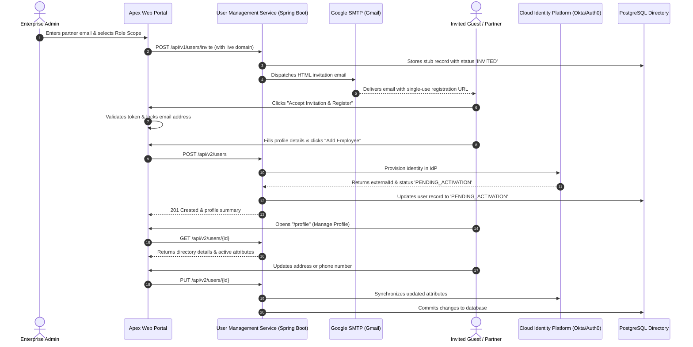

# Apex Identity Enterprise Suite
## Client Presentation, Feature Guide & End-to-End Demo Script

---

## 1. Executive Summary & Value Proposition

### The Enterprise Problem
Enterprises managing legacy IT systems face a critical dilemma when modernizing their identity infrastructure:
* **High Migration Risk**: Migrating millions of corporate identities from aging on-premise LDAP / legacy directories to modern Cloud Identity Providers (such as **Okta, Auth0, Keycloak, or Microsoft Entra ID**) typically risks service downtime, broken partner integrations, and lost user credentials.
* **Broken Partner Onboarding**: Older systems rely on email-based invitation links and tokens. Modern systems rely on centralized OIDC/SAML federated identity flows. Moving overnight breaks third-party vendor access, contractor workflows, and compliance audits.

### The Apex Identity Solution
**Apex Identity Enterprise Suite** is an enterprise-grade reference platform demonstrating a **zero-downtime Identity Provider (IdP) migration** using the **Strangler Fig architectural pattern**:
1. **Backward-Compatible Legacy Coexistence (API v1)**: Legacy contractor and partner applications continue issuing secure, time-limited email invitations without disruption.
2. **Modern Greenfield Self-Service (API v2)**: Employees and partners enjoy a responsive, modern web portal for initial onboarding and ongoing profile management.
3. **Pluggable Adapter Layer**: An abstraction layer in the backend allows switching or simultaneously orchestrating legacy directories and modern cloud IdPs via configuration, without touching frontend applications.
4. **Strict Enterprise Security**: Passwords are never collected or stored in the frontend; user accounts are staged in `PENDING_ACTIVATION` for first-login Multi-Factor Authentication (MFA) setup directly with the certified Identity Platform.

---

## 2. Live Client Access Information

The client can access the live application directly from any desktop, tablet, or mobile browser:

| Portal Section | Live URL | Description |
| :--- | :--- | :--- |
| **Main Portal / Manage Profile** | [https://apex-identity-demo.loca.lt/profile](https://apex-identity-demo.loca.lt/profile) | Employee directory view and real-time profile attribute synchronization |
| **Employee Registration** | [https://apex-identity-demo.loca.lt/register](https://apex-identity-demo.loca.lt/register) | Greenfield profile creation and identity platform staging |
| **Partner & Guest Invitations** | [https://apex-identity-demo.loca.lt/legacy-demo](https://apex-identity-demo.loca.lt/legacy-demo) | Dispatch real verified invitation emails to personal or corporate inboxes |

> [!NOTE]
> **Localtunnel First-Time Verification Notice**:
> When opening `https://apex-identity-demo.loca.lt` for the first time, Localtunnel may present a security prompt asking for the "Tunnel IP Password".
> Simply enter the host IP: **`125.62.195.166`** (or click the button provided on screen) to enter the portal.

---

## 3. Core Features Breakdown

```
┌─────────────────────────────────────────────────────────────────────────────┐
│                       APEX IDENTITY ENTERPRISE SUITE                        │
├───────────────────────────────┬───────────────────────────────┬─────────────┤
│  👤 MANAGE PROFILE            │  ✨ ADD EMPLOYEE               │  ✉️ INVITES  │
│  • Directory Attribute Sync   │  • RFC-Compliant Validation   │  • SMTP     │
│  • Real-time IdP Mirroring    │  • Staged Provisioning        │  • Tokens   │
│  • Address & Dept Management  │  • First-Login MFA Readiness  │  • Ledger   │
└───────────────────────────────┴───────────────────────────────┴─────────────┘
```

### Feature 1: Partner & Guest Invitations (`/legacy-demo`)
* **Automated Outbound Emailing**: Dispatches genuine corporate onboarding emails directly to the recipient's personal inbox (powered by Google Enterprise SMTP).
* **Single-Use Cryptographic Tokens**: Every invitation generates a unique redemption token (`tok_...`) bound to the recipient's role scope with a strict 48-hour expiry window.
* **Role Scoping**: Admins can assign specific role privileges prior to onboarding (`Standard Contributor`, `Portal Viewer`, or `Organization Admin`).
* **Audit Directory Ledger**: Automatically logs pending invitations in the corporate database ledger for SOC 2 and compliance traceability.

### Feature 2: Workforce Onboarding & Registration (`/register`)
* **Token-Aware Redemption**: Clicking the link received in the email pre-validates the cryptographic token and locks the verified email address to prevent impersonation.
* **Comprehensive Attribute Validation**: Validates international phone formatting, street address, and strict legal compliance checks (such as 18+ age verification).
* **Zero-Password Frontend Architecture**: In compliance with modern identity best practices, the React frontend never touches passwords. Accounts are staged in `PENDING_ACTIVATION` so the user defines their password and multi-factor credentials securely in the Identity Platform upon first login.

### Feature 3: Self-Service Profile Governance (`/profile`)
* **Live Corporate Directory Card**: Displays employee status badges (`ACTIVE`, `PENDING_ACTIVATION`, `INVITED`, `SUSPENDED`), assigned enterprise ID, and department tags.
* **Bidirectional Synchronization**: Any modification made by the user (phone number, residential address, department preferences) is persisted to PostgreSQL and immediately synchronized to the downstream Identity Platform via REST API.

### Feature 4: Enterprise Identity Provider Migration Engine
* **Strategy & Factory Pattern**: The backend `IdentityProviderFactory` decouples the application from the underlying vendor. Switching from an internal LDAP/database to Okta or Auth0 is achieved via a single configuration flag without rewriting application logic.
* **Smart Invitation Claiming**: When an invited guest accepts an invitation, the system transparently upgrades their placeholder record into an activated profile without duplicate account errors.

---

## 4. End-to-End Workflow



---

## 5. Step-by-Step Client Demo Script (5-Minute Walkthrough)

Follow this structured script when demonstrating the platform to your client:

### Step 1: The Elevator Pitch (1 Minute)
> *"Welcome! Today I am showing you the **Apex Identity Enterprise Suite**. This platform solves one of the biggest challenges enterprises face: migrating their user base to a modern Cloud Identity Provider like Okta or Auth0 without disrupting existing contractors, partners, or legacy systems.*
>
> *We have two integrated applications running live: a modern React Profile Portal and a Spring Boot backend connected to PostgreSQL and enterprise SMTP."*

### Step 2: Demonstrate the Invitation Flow (1.5 Minutes)
1. Navigate to the **Invitations** tab: `https://apex-identity-demo.loca.lt/legacy-demo`
2. Explain:
   > *"Here an administrator can invite external partners or contractors. Let's send a live invitation."*
3. Enter the client's email (or your own Gmail address: `saibhanu301@gmail.com`).
4. Select Role Scope: **`Standard Contributor • Regular Workforce Scope`**.
5. Click **"Send Invitation Link"**.
6. Point to the result card:
   * Highlight **Invitation Status**: `Dispatched`
   * Highlight **Delivery Method**: `Google SMTP (Delivered to Inbox)` in green.
   * Highlight the **Direct Invitation Link**: point out that it is dynamically bound to the live HTTPS domain, not `localhost`.

### Step 3: Check Email & Redeem the Invitation (1.5 Minutes)
1. Open the inbox to show the incoming email:
   * **Subject**: *"You're invited to join Apex Identity Enterprise Portal"*
   * **Branding**: Official corporate HTML email styling, single-use security notice, and action button.
2. Click **"Accept Invitation & Register &rarr;"** (or click **"Open Registration Link &rarr;"** on the portal screen).
3. Point out the top verification banner:
   * *"Verified Partner Invitation • Token Active • Ready for Registration"*
   * Note that the recipient's email is locked and pre-filled for security.
4. Fill out the registration form:
   * First Name: `John` | Last Name: `Doe`
   * Date of Birth: `1992-06-15` (highlight that the field enforces 18+ legal validation)
   * Phone Number: `+1 (555) 019-2834`
   * Street: `100 Enterprise Way` | City: `San Francisco` | Zip: `94105`
   * Department: `Engineering` | Employee ID: `EMP-88012`
5. Click **"Add Employee"**.
6. Highlight the success screen:
   * Status: **`PENDING_ACTIVATION`**
   * Explain:
     > *"Notice that the employee is immediately staged in the new Identity Platform. Following enterprise zero-trust standards, no passwords were sent through the browser. The user will set up their password and MFA upon first login directly with the Identity Platform."*

### Step 4: Show Manage Profile & Live IdP Sync (1 Minute)
1. Navigate to **Manage Profile**: `https://apex-identity-demo.loca.lt/profile`
2. Show the summary card with the status badge and department attributes.
3. Update an attribute (e.g., change City or Phone Number) and click **"Save Changes"**.
4. Point out the success banner:
   > *"The update is saved locally and instantaneously pushed to the downstream cloud Identity Provider via REST API, ensuring zero data divergence across systems."*

---

## 6. Frequently Asked Client Questions

#### Q1: "Why does the registration create users in `PENDING_ACTIVATION` instead of asking for a password?"
**A**: This is an intentional enterprise security best practice. Collecting passwords in custom frontend applications introduces credential harvesting risks. By provisioning accounts in `PENDING_ACTIVATION`, the third-party Identity Platform (Okta/Auth0) sends a dedicated activation challenge on first sign-in where the employee sets their password and enrolls their FIDO2/WebAuthn or MFA authenticator app in a tamper-proof environment.

#### Q2: "Can we switch identity providers in the future?"
**A**: Yes. Thanks to the **Adapter Pattern (`IdentityProviderClient`)**, the backend isolates all provider-specific API calls. Migrating from Okta to Keycloak or Microsoft Entra ID only requires adding a new client implementation without touching any of the frontend components or database schemas.

#### Q3: "Is this containerized and production-ready?"
**A**: Yes. The repository includes:
* Multi-stage Dockerfiles for both frontend (Nginx) and backend (Spring Boot / JRE 17).
* A complete `docker-compose.yml` for local and staging deployments.
* Complete Kubernetes (K8s) manifests with Kustomize, Pod Security Standards, Horizontal Pod Autoscaling (HPA), and TLS Ingress routing.
