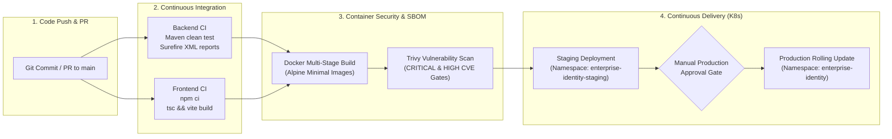
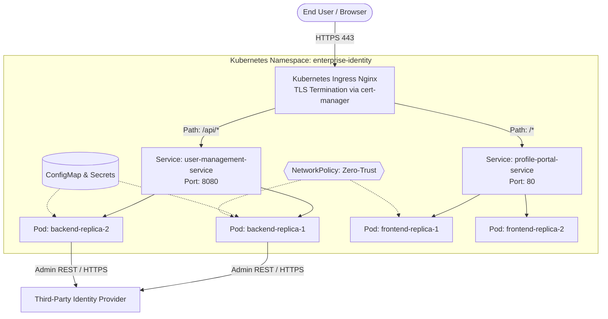

# Enterprise CI/CD and Kubernetes Deployment Guide

This guide documents the automated build, security scanning, container packaging, and Kubernetes deployment architecture for the **React Profile Portal** and **Spring Boot User Management Service**.

---

## 1. End-to-End CI/CD Pipeline Architecture

The delivery workflow runs via **GitHub Actions** (configured in [`.github/workflows/ci-cd.yml`](file:///Users/bhanu/Documents/ep/.github/workflows/ci-cd.yml)):



### Pipeline Stages

| Stage | Trigger | Actions | Gate Criteria |
| :--- | :--- | :--- | :--- |
| **Backend CI** | PR / Push | Java 17 Temurin, `mvn clean test`, generate Surefire test reports | 100% tests pass, 0 compile errors |
| **Frontend CI** | PR / Push | Node 20, `npm ci`, strict TypeScript `tsc`, Vite production asset build | 0 type errors, production bundle archived |
| **Container & Security** | Post-Test | Multi-stage Docker build, vulnerability scanning with Aqua Trivy | 0 unfixed CRITICAL/HIGH CVEs |
| **Staging Rollout** | Push to `develop` / `main` | Kustomize manifest validation, automated deployment to staging cluster | Probes healthy, 2/2 pods ready |
| **Production Rollout** | Promotion | Environment approval gate, zero-downtime rolling update with automated rollback | Zero HTTP 5xx errors, PDB respected |

---

## 2. Kubernetes Cluster Topology

All production resources are defined declaratively in the [`k8s/`](file:///Users/bhanu/Documents/ep/k8s) directory.



### Manifest Manifest Catalog

1. **[`k8s/namespace.yaml`](file:///Users/bhanu/Documents/ep/k8s/namespace.yaml)**: Defines `enterprise-identity` with Pod Security Standard set to `restricted`.
2. **[`k8s/configmap.yaml`](file:///Users/bhanu/Documents/ep/k8s/configmap.yaml)**: Environment variables for active IdP mode (`NEW` vs `LEGACY`), IdP endpoints, issuer URIs, and frontend proxy bases.
3. **[`k8s/secret.yaml`](file:///Users/bhanu/Documents/ep/k8s/secret.yaml)**: Sensitive administrative API tokens and DB credentials (integrated with HashiCorp Vault or External Secrets Operator).
4. **[`k8s/backend-deployment.yaml`](file:///Users/bhanu/Documents/ep/k8s/backend-deployment.yaml)**:
   - **Replicas**: 2 (autoscaling up to 10 via HorizontalPodAutoscaler on CPU > 75%).
   - **Zero-Downtime Strategy**: `RollingUpdate` with `maxSurge: 1` and `maxUnavailable: 0`.
   - **Security**: Non-root user (`runAsUser: 10001`), privilege escalation disabled, capabilities dropped (`ALL`).
   - **Probes**: Liveness (`/api/v2/users/demo`) and Readiness probes to guarantee only healthy pods receive traffic.
   - **Resilience**: `PodDisruptionBudget` ensuring minimum 1 replica available during node upgrades.
5. **[`k8s/frontend-deployment.yaml`](file:///Users/bhanu/Documents/ep/k8s/frontend-deployment.yaml)**:
   - High-performance Nginx web server serving pre-compiled React SPA assets.
   - Probes on port 80, non-root user `nginx:101`.
   - Autoscaling up to 8 replicas.
6. **[`k8s/ingress.yaml`](file:///Users/bhanu/Documents/ep/k8s/ingress.yaml)**: Single ingress point with automatic TLS termination via `cert-manager` Let's Encrypt cluster issuer.
7. **[`k8s/network-policy.yaml`](file:///Users/bhanu/Documents/ep/k8s/network-policy.yaml)**: Micro-segmentation restricting ingress solely to the ingress controller and restricting pod egress to DNS and outbound HTTPS (port 443) for the IdP.
8. **[`k8s/kustomization.yaml`](file:///Users/bhanu/Documents/ep/k8s/kustomization.yaml)**: Unified Kustomize root for continuous GitOps synchronization.

---

## 3. Zero-Downtime Rolling Deployments

To ensure zero dropped user requests during identity provider updates:
```yaml
strategy:
  type: RollingUpdate
  rollingUpdate:
    maxSurge: 1
    maxUnavailable: 0
```
- **Surge First**: Kubernetes launches a new pod with the new container image before terminating any old pod.
- **Readiness Gate**: Traffic is not routed to the new pod until its `readinessProbe` returns HTTP 200 for 15 seconds.
- **Graceful Shutdown**: When old pods receive `SIGTERM`, Spring Boot finishes in-flight requests before terminating (configured via `server.shutdown: graceful`).

---

## 4. Deploying to Kubernetes

### Local Testing with Minikube / Kind / Docker Desktop
```bash
# 1. Apply all resources via Kustomize
kubectl apply -k ./k8s

# 2. Check rollout status
kubectl rollout status deployment/user-management-deployment -n enterprise-identity
kubectl rollout status deployment/profile-portal-deployment -n enterprise-identity

# 3. View running pods
kubectl get pods -n enterprise-identity -o wide
```

### GitOps Delivery (ArgoCD / Flux)
In production, point your ArgoCD Application manifest to `path: k8s` of this repository. Automated reconciliation guarantees declarative state compliance.
