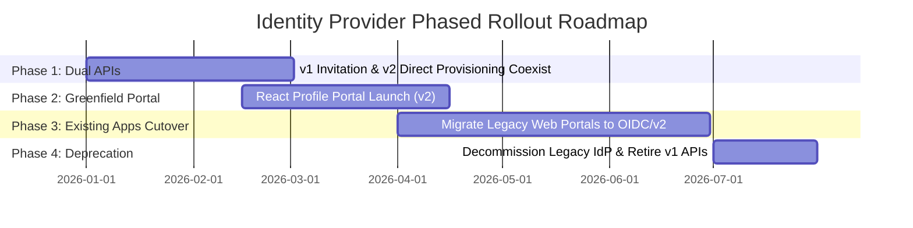

# Migration Strategy: Identity Provider Modernization

## 1. Context & Architectural Shift

The enterprise is transitioning from a legacy identity provider to a third-party Identity Platform (e.g. Okta, Auth0, Ping Identity, Keycloak).

### Fundamental Differences in Registration Flows

| Attribute | Legacy Identity Flow | New Third-Party Identity Platform |
| :--- | :--- | :--- |
| **Lifecycle Model** | Invitation-based | Direct Provisioning + First-Login Activation |
| **Initial Action** | Backend issues invitation link via email | Backend provisions user in IdP (`PENDING_ACTIVATION`) |
| **Password Setup** | Custom portal screen or legacy reset page | Identity Provider hosted self-service screen |
| **MFA Enrollment** | Legacy SMS or internal factor registry | Modern MFA: FIDO2/WebAuthn, TOTP, Push Verify |
| **API Version** | `/api/v1/users/invite` | `/api/v2/users` |

---

## 2. Coexistence & Phased Migration Roadmap

### Phase 1: Dual-Version API Coexistence (Current State)
- The Spring Boot User Management Service exposes both `/api/v1` and `/api/v2`.
- Existing client portals continue to call `/api/v1/users/invite` without disruption.
- Greenfield React Profile Portal uses `/api/v2/users`.
- Backend uses the **Adapter / Strategy Pattern** (`IdentityProviderFactory`) to abstract provider differences.

### Phase 2: Greenfield Portal Pilot & Validation
- New users register through the React Profile Portal.
- Users are created in `PENDING_ACTIVATION` state.
- Users complete password and MFA setup during their initial login redirect.

### Phase 3: Legacy Application Migration & Single Sign-On (SSO)
- Existing portals switch their authentication redirects to the new Identity Provider using OIDC Authorization Code Flow with PKCE.
- Because both portals share the same Identity Provider issuer, users enjoy seamless SSO across applications.

### Phase 4: Legacy Deprecation
- All applications verify zero remaining dependencies on `/api/v1/users/invite`.
- The legacy identity directory is frozen and decommissioned.
- `LegacyIdentityProviderClient` and `/api/v1` are retired cleanly.

---

## 3. Backward Compatibility Checklist
- [x] No changes required to existing caller contracts for `/api/v1/users/invite`.
- [x] User records in local database store `external_identity_id` to link both old and new provider identifiers.
- [x] Spring Security allows CORS from both old portal origins and the new React Profile Portal.
- [x] Error responses conform to standard RFC 7807 problem details across all versions.
